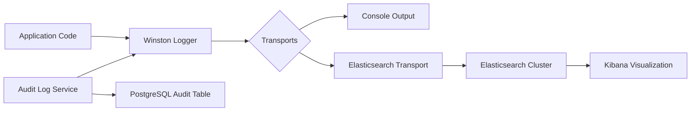
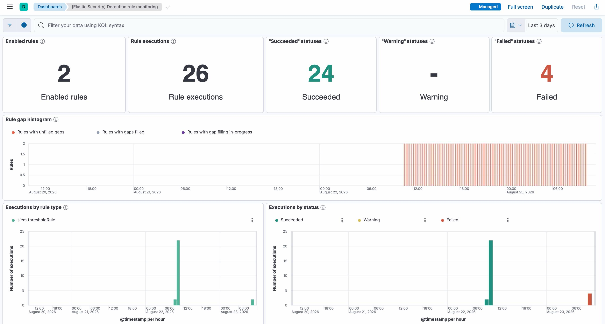
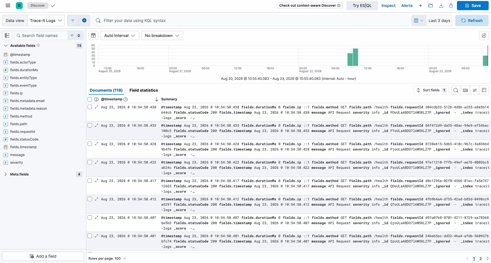
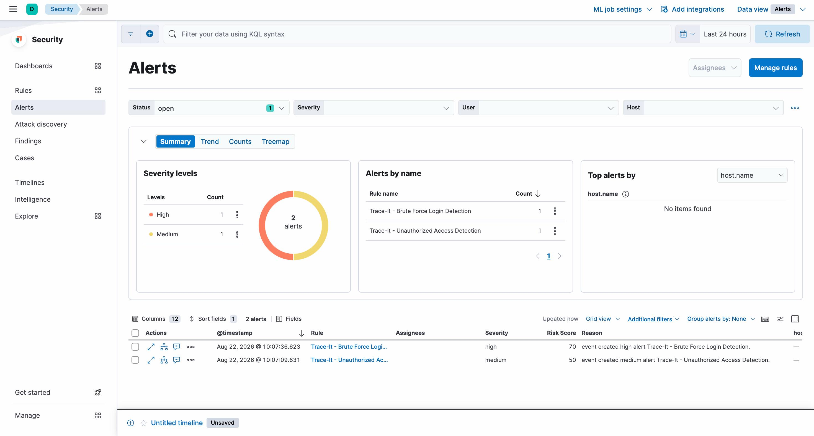

# Trace-It SIEM Implementation

## 1. SIEM Overview

A Security Information and Event Management (SIEM) system provides real-time analysis of security alerts generated by applications and network hardware. It collects, aggregates, and analyzes log data from various sources to detect security threats and facilitate incident response.

**Relevance to Trace-It**: 
Trace-It handles sensitive donation and NGO data, requiring monitoring for unauthorized access, data breaches, and compliance violations. The SIEM implementation provides centralized logging and basic security event visibility.

**Security Problem Addressed**: 
Lack of centralized visibility into security-relevant events across the application, making it difficult to detect and investigate suspicious activities.

## 2. Trace-It SIEM Architecture

### Components Involved
- **Trace-It Backend**: Generates application logs and security events
- **Winston Logger**: Application logging library configured with multiple transports
- **Elasticsearch**: Distributed search and analytics engine for log storage
- **Kibana**: Visualization dashboard for Elasticsearch data
- **Audit Log Service**: Specialized service for writing security-relevant events

### Data Flow
1. Application code generates logs via Winston logger
2. Winston sends logs to:
   - Console (for development)
   - Elasticsearch transport (when configured)
3. Audit log events are written to PostgreSQL database AND sent via Winston logger
4. Elasticsearch stores and indexes the log data
5. Kibana provides web interface to search, visualize, and analyze logs

### Mermaid Architecture Diagram

## 3. Implementation

### Technologies/Tools Used
- **Winston.js** (v3.x): Logging library
- **winston-elasticsearch** transport: Sends logs to Elasticsearch
- **Elasticsearch 8.19.2**: Log storage and indexing
- **Kibana 8.19.2**: Log visualization and exploration
- **Docker Compose**: Orchestration of Elasticsearch and Kibana

### Configuration Files
1. **traceit-siem/docker-compose.yml**: Defines Elasticsearch and Kibana services
2. **traceit-siem/.env**: Environment variables for Elasticsearch authentication and encryption keys
3. **backend/src/utils/logger.ts**: Winston logger configuration with Elasticsearch transport
4. **backend/src/services/auditLogService.js**: Security event logging service

### Key Implementation Details
- Logger configured in `logger.ts` with conditional Elasticsearch transport based on `ELASTICSEARCH_URL` environment variable
- Elasticsearch transport configured with:
  - Index: `traceit-logs`
  - Authentication using username/password from environment
  - JSON log format with timestamp, level, message, and metadata
- Audit log service (`auditLogService.ts`) writes to database AND calls `logger.info()` for security events
- Security events include: action type, actor information, entity details, IP address, request ID, and metadata

### Important Files
- `backend/src/utils/logger.ts` - Central logging configuration
- `backend/src/services/auditLogService.ts` - Security event emission
- `traceit-siem/docker-compose.yml` - SIEM infrastructure
- `traceit-siem/.env` - SIEM credentials and configuration
- `backend/siem-smoke-test.js` - End-to-end validation test
- `backend/siem-event-test.ts` - Security event injection test

## 4. Security Monitoring

### Currently Monitored Events
1. **HTTP Request Telemetry**: 
   - All incoming HTTP requests logged with method, path, status code, duration, IP, and request ID
   - Implemented via Express request logger middleware (inferred from smoke test)
2. **Audit Log Events**: 
   - Security-relevant actions from `writeAuditLog` function
   - Includes: entity access, modifications, permission changes, government requests
3. **Application Errors**: 
   - Uncaught exceptions and error stacks via Winston error format

### Visible Information in Kibana
- Log messages in JSON format with fields:
  - `timestamp`: Event time
  - `level`: Log level (info, error, etc.)
  - `message`: Log message
  - `fields`: Nested object containing:
    - `requestId`: Unique request identifier
    - `method`: HTTP method
    - `path`: Request path
    - `statusCode`: HTTP status code
    - `durationMs`: Request processing time
    - `ip`: Client IP address
    - Plus audit-specific fields: `eventType`, `actorType`, `entityType`, etc.

### Implemented Functionality
- **Log Collection**: Application logs sent to Elasticsearch via Winston
- **Log Storage**: Elasticsearch indexes and stores logs
- **Basic Visualization**: Kibana provides search and filtering capabilities
- **Correlation**: Manual correlation possible via requestId across logs
- **Alerting**: None implemented (requires Kibana alerting configuration)
- **Dashboards**: None implemented (requires Kibana dashboard creation)

### Distinction: Implemented vs Future Ideas
- **Implemented**: Log ingestion, storage, basic search
- **Not Implemented**: 
  - Pre-built security dashboards
  - Automated alerting rules
  - Log retention policies
  - Role-based access control for Kibana
  - Advanced correlation rules
  - Integration with intrusion detection systems

## 5. Validation / Testing

### Test Description
End-to-end validation of the logging pipeline using `siem-smoke-test.js`:
1. Sends HTTP request with unique request ID to backend
2. Verifies backend responds successfully
3. Queries Elasticsearch for log entry with matching request ID
4. Validates all expected telemetry fields are present and correct

### Test Evidence
- **File**: `backend/siem-smoke-test.js`
- **Verification**: Test passes when backend running and Elasticsearch accessible
- **Output**: Displays validation steps and confirms pipeline integrity

### Additional Validation
- **File**: `backend/siem-event-test.ts`
- **Purpose**: Tests injection of security events via audit log service
- **Verification**: Confirms audit log events reach Elasticsearch (after manual flush wait)

### Limitations of Testing
- Tests require manual startup of backend and Elasticsearch/Kibana stack
- No automated test suite in CI/CD pipeline
- Tests validate ingestion but not visualization or alerting

## 6. Demonstration

### Live Demonstration Steps
1. Start Elasticsearch and Kibana via `docker-compose up` in `traceit-siem/` directory
2. Start Trace-It backend
3. Execute `siem-smoke-test.js` to generate test log entry
4. Open Kibana at http://localhost:5601
5. Navigate to Discover view and select `traceit-logs-*` index pattern
6. Search for recent log entries to demonstrate:
   - HTTP request telemetry
   - Security event logs (if audit test was run)

### Most Useful Screens/Events to Show
1. **HTTP Request Log**: Shows end-to-end tracing with requestId
2. **Audit Log Entry**: Demonstrates security event capture
3. **Search Capability**: Shows ability to filter by fields (e.g., `eventType: UNAUTHORIZED_DOC_ACCESS`)
4. **Field Analytics**: Demonstrates Kibana's ability to visualize status code distributions, etc.

## 7. Screenshots

### SIEM Dashboard

### SIEM Discover

### SIEM Alerts

## 8. Current Limitations

1. **No Pre-built Dashboards**: Requires manual creation of visualizations in Kibana
2. **No Alerting**: Missing automated notifications for security events
3. **Limited Log Sources**: Only backend logs; no frontend, infrastructure, or database logs
4. **No Retention Policy**: Indefinite log storage may cause disk space issues
5. **Basic Authentication**: Uses simple username/password; no modern SSO or RBAC
6. **Single Node Elasticsearch**: No clustering or high availability
7. **No Log Structuring Standard**: Inconsistent field naming across different log types
8. **No Privacy Controls**: Potential logging of sensitive data requiring filtering

## 9. Future Improvements

### Production-Grade Enhancements
1. **Security Dashboards**: 
   - Failed login attempts
   - Unauthorized access patterns
   - Geographic access anomalies
   - Privileged account usage
2. **Alerting Rules**:
   - Brute force detection
   - Impossible travel alerts
   - Privilege escalation patterns
   - Data exfiltration indicators
3. **Expanded Log Sources**:
   - Frontend error logs
   - Infrastructure metrics (CPU, memory, disk)
   - Database query logs
   - Container logs
4. **Operational Improvements**:
   - Index lifecycle management for log retention
   - role-based access control for Kibana
   - Multi-node Elasticsearch cluster
   - TLS encryption for data in transit
   - Centralized credential management
5. **Advanced Analytics**:
   - Machine learning job for anomaly detection
   - Custom correlation rules for attack chains
   - Integration with threat intelligence feeds

### Immediate Next Steps
1. Create basic security dashboard in Kibana
2. Configure alert for repeated failed authentication attempts
3. Add log filtering to prevent sensitive data leakage
4. Document log schema and field definitions
5. Integrate with existing authentication logs