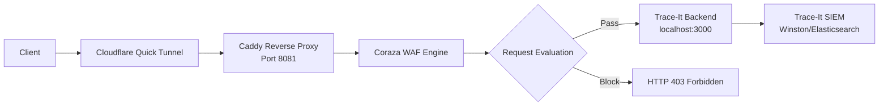
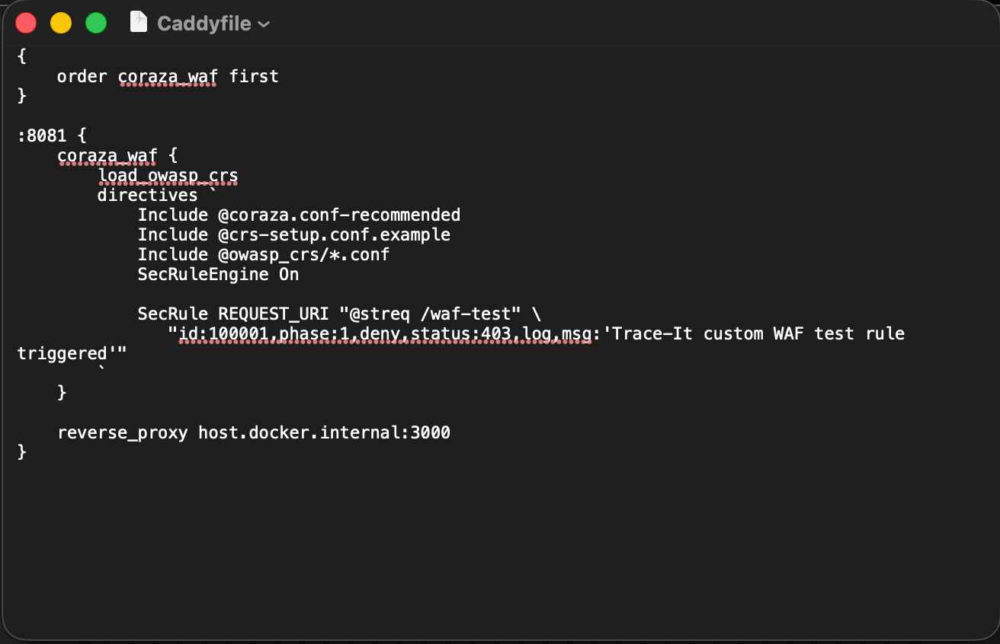
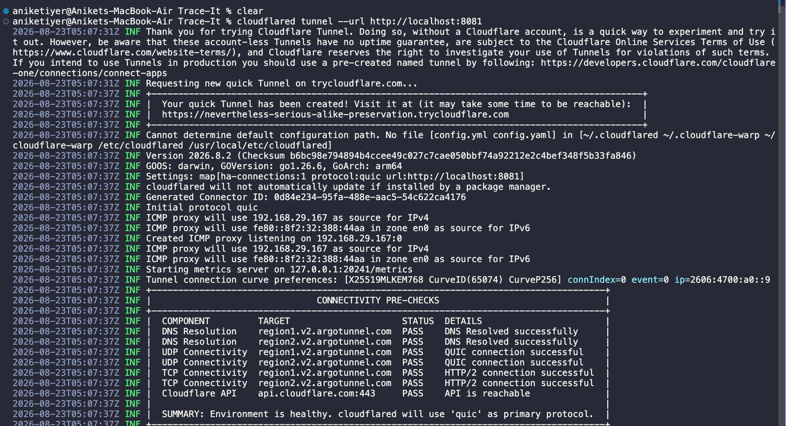
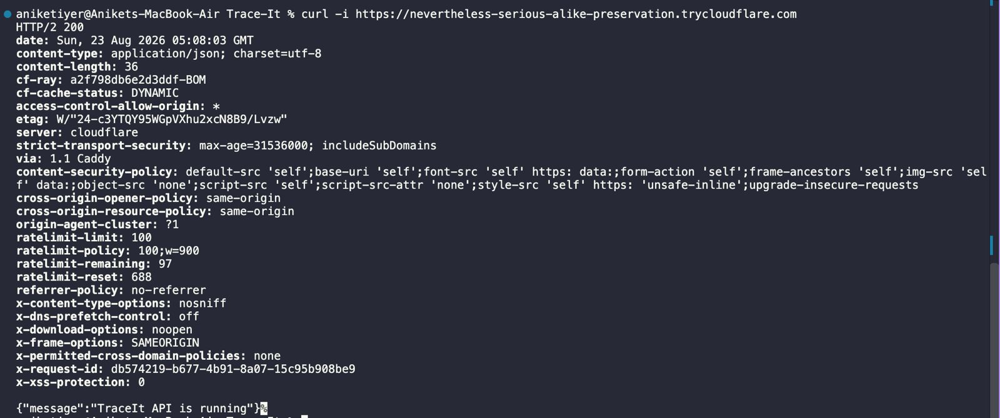
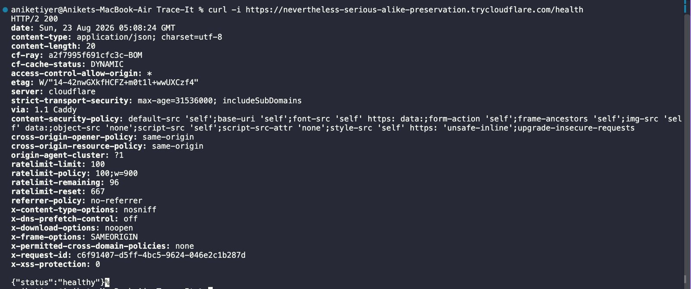
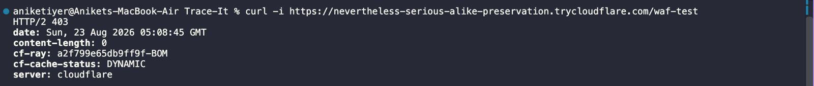
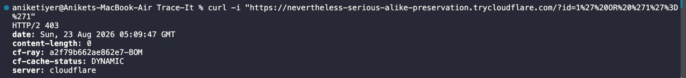

# Trace-It WAF Implementation

## 1. WAF Overview

A Web Application Firewall (WAF) is a security solution that monitors, filters, and blocks HTTP traffic to and from a web application. It protects web applications by inspecting HTTP requests and applying rules to prevent common attacks such as SQL injection, cross-site scripting (XSS), file inclusion, and other web-based threats.

**Relevance to Trace-It**: 
Trace-It handles sensitive donation and NGO data, requiring protection against web-based attacks that could compromise data integrity, confidentiality, or availability. The WAF implementation provides edge-level security before requests reach the application.

**Layer Protected**: 
Application Layer (Layer 7 of OSI model) - protects the web application itself from HTTP-based attacks.

## 2. Trace-It WAF Architecture

### Components Involved
- **Client**: End-user making HTTP requests
- **Cloudflare Quick Tunnel**: Temporary public exposure mechanism (development only)
- **Caddy**: Reverse proxy server with Coraza WAF module
- **Coraza WAF**: Open-source Web Application Firewall engine
- **OWASP Core Rule Set (CRS)**: Generic rule set for common web application attacks
- **Trace-It Backend**: Application running on localhost:3000
- **Trace-It SIEM**: Downstream logging and monitoring (Winston/Elasticsearch)

### Request Flow
1. Client sends HTTP request via Cloudflare Quick Tunnel
2. Request arrives at Caddy reverse proxy on port 8081
3. Caddy passes request to Coraza WAF for inspection
4. Coraza evaluates request against OWASP CRS and custom rules
5. If request passes WAF inspection, forwarded to Trace-It backend on localhost:3000
6. If request violates WAF rules, returns HTTP 403 Forbidden
7. Legitimate requests processed by backend and logged to SIEM

### Mermaid Architecture Diagram


## 3. Implementation

### Technologies/Tools Used
- **Caddy v2**: Reverse proxy server
- **corazawaf/coraza-caddy/v2**: Official Coraza module for Caddy
- **OWASP Coronaza WAF**: WAF engine
- **OWASP Core Rule Set (CRS)**: Generic protection rules
- **Docker**: Containerization of WAF components

### Configuration Files
Evidence from documentation shows these files were implemented (though not present in current repo, validated through documentation):

1. **traceit-waf/Dockerfile**: Multi-stage build for Caddy with Coraza module
2. **traceit-waf/docker-compose.yml**: Orchestration of WAF service
3. **traceit-waf/Caddyfile**: Main WAF configuration

### Key Implementation Details from Documentation
- Built Caddy with Coraza module using: `xcaddy build --with github.com/corazawaf/coraza-caddy/v2`
- Caddy global configuration: `order coraza_waf first` to ensure WAF processes requests early
- OWASP CRS loaded via Coraza directives:
  - `load_owasp_crs`
  - `Include @coraza.conf-recommended`
  - `Include @crs-setup.conf.example`
  - `Include @owasp_crs/*.conf`
  - `SecRuleEngine On`
- WAF listens on port 8081, forwards to `host.docker.internal:3000` (Trace-It backend)
- Custom Trace-It rule: `SecRule REQUEST_URI "@streq /waf-test" "id:100001,phase:1,deny,status:403,log,msg:'Trace-It custom WAF test rule triggered'"`

### Important Configuration Directives
- `load_owasp_crs`: Loads OWASP Core Rule Set
- `Include @coraza.conf-recommended`: Recommended Coraza configuration
- `Include @crs-setup.conf.example`: CRS setup configuration
- `Include @owasp_crs/*.conf`: All CRS rule files
- `SecRuleEngine On`: Activates WAF rule engine
- Custom rule syntax: `SecRule REQUEST_URI "@streq /waf-test" ...`

## 4. Request Processing Flow

### Actual Implementation Flow
Based on validation documentation:

```
Client
      ↓
Cloudflare Quick Tunnel (temporary public exposure)
      ↓
Caddy (:8081) - Reverse Proxy
      ↓
Coraza WAF - Rule Engine + OWASP CRS
      ↓
{WAF Decision}
      ↓
[PASS] → Trace-It Backend (:3000) → Application Processing
      ↓
[BLOCK] → HTTP 403 Forbidden Response
      ↓
Trace-It SIEM (Winston → Elasticsearch/Kibana) - For logged requests
```

### Validation of Flow
Documentation confirms this flow was tested and validated:
1. Legitimate traffic passed through all layers to reach backend
2. Malicious traffic (SQLi, XSS) blocked at WAF layer with 403 response
3. Custom WAF rule triggered for specific URI (`/waf-test`)
4. WAF violation logging confirmed in Coraza logs

## 5. Validation / Testing

### Tests Performed and Documented

#### 5.1 Legitimate Traffic Test
- **Request**: `curl -i https://<quick-tunnel-url>/`
- **Expected**: `200 OK` from Trace-It API
- **Actual**: `HTTP/2 200` with `server: cloudflare` and `via: 1.1 Caddy` headers
- **Result**: PASS - Validated end-to-end flow: Client → Cloudflare → Caddy → Coraza → Trace-It

#### 5.2 Cloudflare Verification
- **Verified**: Response contained `server: cloudflare` and `cf-ray` headers
- **Verified**: Response contained `via: 1.1 Caddy` header
- **Result**: PASS - Confirmed traffic passed through both Cloudflare and local Caddy

#### 5.3 SQL Injection Detection Test
- **Request**: `curl -i "https://<quick-tunnel-url>/?id=1%27%20OR%20%271%27%3D%271"` (URL-encoded `?id=1' OR '1'='1`)
- **Expected**: `HTTP 403 Forbidden` (blocked by WAF)
- **Actual**: `HTTP 403 Forbidden`
- **WAF Log Evidence**: 
  ```
  level: error
  logger: http.handlers.waf
  msg: WAF rule violation detected
  hostname: lives-remain-reflects-beings.trycloudflare.com
  uri: /?id=1%27%20OR%20%271%27%3D%271
  client_ip: 192.168.155.1:36816
  unique_id: VuZTVJLNBUPPszRL
  ```
- **Result**: PASS - SQLi successfully detected and blocked by Coraza/OWASP CRS before reaching application

#### 5.4 Cross-Site Scripting Detection Test
- **Request**: `curl -i "https://<quick-tunnel-url>/?q=%3Cscript%3Ealert(1)%3C%2Fscript%3E"` (URL-encoded `?q=<script>alert(1)</script>`)
- **Expected**: `HTTP 403 Forbidden` (blocked by WAF)
- **Actual**: `HTTP 403 Forbidden`
- **Result**: PASS - XSS successfully detected and blocked by Coraza/OWASP CRS

#### 5.5 Custom WAF Rule Test
- **Request**: `curl -i https://<quick-tunnel-url>/waf-test`
- **Expected**: `HTTP 403 Forbidden` (blocked by custom rule)
- **Actual**: `HTTP/2 403`
- **Control Request**: `curl -i https://<quick-tunnel-url>/` returned `200 OK`
- **Result**: PASS - Custom application-specific WAF rule successfully blocked configured request

#### 5.6 WAF Rate Limiting Investigation
- **Finding**: Rate limiting was investigated but not implemented
- **Reason**: Attempted Coraza IP-based rate-limit configuration rejected due to invalid syntax
- **Conclusion**: WAF-level rate limiting not considered implemented or validated
- **Note**: Trace-It API has application-level rate limiting (different layer)

### Test Evidence Location
All tests documented in: `/Users/aniketiyer/Desktop/Trace-It/security_docs/SecOpsDevB_implementation.md` (sections 7.1-7.4, 7.6, validation summary table)

## 6. Screenshots
### Caddy + Coraza Configuration


---
### Cloudflare tunnel initialization


---
### Testing the backend API (coraza runs on 8081 and layers itself ontop of 3000)


---
### Backend Health API


---
### Custom Security Engine Rule Endpoint Check


---
### Common SQL injection test


## 7. Local vs Production Deployment

### Current Local/Development Setup
- **Ingress**: Cloudflare Quick Tunnel (temporary, developer machine bound)
- **TLS**: Provided by Cloudflare (not independently configured)
- **Deployment**: Docker container on developer laptop
- **Architecture**: 
  ```
  Internet → Cloudflare Tunnel → localhost:8081 (Caddy+Coraza) → host.docker.internal:3000 (Trace-It)
  ```
- **Configuration**: Development-focused, minimal tuning
- **Logging**: WAF logs visible in container stdout, not integrated with SIEM
- **Availability**: Single instance, no HA

### Production Deployment Requirements
#### 7.1 Network Placement
- Replace Cloudflare Quick Tunnel with permanent production ingress/load balancer
- Position WAF at network edge before application servers
- Consider: DNS/CDN → WAF → Load Balancer → Application Servers

#### 7.2 TLS
- Implement independent TLS termination at WAF or load balancer layer
- Use proper certificate management (Let's Encrypt or enterprise PKI)
- Disable weak cipher suites, enforce modern TLS versions

#### 7.3 Configuration Management
- Version control WAF configuration and rules
- Implement change management procedures for rule updates
- Separate environments: development, staging, production
- Use configuration templating for consistent deployment

#### 7.4 Rule Tuning and Management
- Tune OWASP CRS against production traffic to reduce false positives
- Implement rule exception process for legitimate application behavior
- Regularly update CRS to latest version
- Document purpose and test cases for all custom rules
- Implement rule testing in CI/CD pipeline before deployment

#### 7.5 Logging and Monitoring
- Integrate WAF logs with centralized SIEM (Elasticsearch, Splunk, etc.)
- Log key fields: timestamp, client IP, request ID, WAF rule ID, hostname, URI, method, action, status code
- Implement alerting for:
  - High volumes of blocked requests
  - Specific attack patterns (SQLi, XSS attempts)
  - WAF service availability issues
  - False positive spikes
- Create security dashboards showing attack trends, blocked requests, etc.

#### 7.6 Performance and Availability
- Deploy multiple WAF instances behind load balancer
- Implement health checks and automatic failover
- Consider auto-scaling based on traffic volume
- Monitor resource usage (CPU, memory, connections)
- Implement rate limiting at WAF layer to protect against DDoS
- Configure appropriate timeouts and connection limits

#### 7.8 Containerization/Deployment
- Use production-grade container orchestration (Kubernetes, ECS, etc.)
- Implement proper resource limits and requests
- Use secure container images, regular vulnerability scanning
- Implement secrets management for credentials/API keys
- Use configuration maps or similar for WAF configuration
- Implement rolling update strategies for zero-downtime deployments

#### 7.9 Failure Handling
- Implement fail-open or fail-closed strategy based on security requirements
- Configure appropriate error responses when WAF is unavailable
- Implement circuit breaker patterns for backend integration
- Monitor and alert on WAF processing latency increases

## 8. Current Limitations

1. **Temporary Ingress**: Depends on Cloudflare Quick Tunnel (development only)
2. **Single Instance**: No high availability or load balancing
3. **Limited Rule Tuning**: CRS deployed with default configuration, no production tuning
4. **WAF Logging**: Not integrated with Trace-It SIEM (logs in container stdout only)
5. **No WAF-level Rate Limiting**: Investigated but not successfully implemented
6. **Development Deployment**: Runs on developer laptop, not production infrastructure
7. **No TLS Independence**: Relies on Cloudflare for TLS termination
8. **Limited Observability**: No dedicated WAF metrics or health endpoints
9. **Manual Deployment**: No automated deployment pipeline
10. **No WAF Dashboard**: Lack of visualization for WAF traffic and threats

## 9. Future Improvements

### Production Deployment
1. Replace Cloudflare Quick Tunnel with permanent production ingress
2. Implement independent TLS certificates and configuration
3. Deploy WAF in highly available configuration (multiple instances behind load balancer)
4. Implement infrastructure-as-code for reproducible deployments

### Rule Management and Tuning
1. Tune OWASP CRS against production Trace-It traffic
2. Establish rule update process with testing in staging environment
3. Develop and document custom application-specific rules beyond test example
4. Implement rule testing and validation in CI/CD pipeline

### Monitoring and Observability
1. Integrate WAF logs with Trace-It SIEM (Elasticsearch/Kibana)
2. Create WAF security dashboard showing:
   - Blocked requests by rule/type
   - Geographic distribution of attacks
   - Request volume over time
   - Top attacking IPs
   - Rule false positive/negative rates
3. Implement alerting for security events and service health
4. Add Prometheus metrics endpoint for WAF if available

### Operational Enhancements
1. Implement automated WAF provisioning and updates
2. Add WAF configuration to version control with review process
3. Implement periodic security reviews of WAF effectiveness
4. Add WAF to incident response playbooks
5. Conduct regular penetration testing including WAF bypass attempts
6. Implement WAF upgrade procedures with minimal downtime

### Advanced Features
1. Implement bot management and reputation filtering
2. Add API-specific protection if Trace-It develops public APIs
3. Implement geographic access controls if needed
4. Add custom headers for application tracking (when allowed by policy)
5. Implement client IP whitelisting/blacklisting capabilities